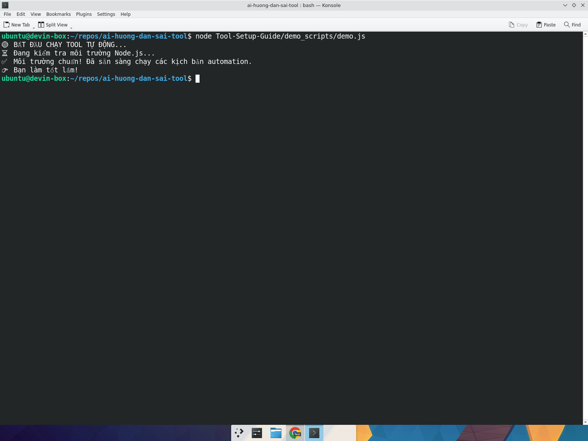

# 🟢 Hướng dẫn cài Node.js LTS trên Ubuntu — Phiên bản dành cho người KHÔNG biết code

> **Đừng lo nếu bạn không biết code, cứ làm y hệt từng bước dưới đây là tool sẽ chạy mượt.** ✨

Sau khi làm xong bài này, bạn sẽ có:
- ✅ Node.js LTS được cài đặt
- ✅ `npm` (trình quản lý gói) sẵn sàng dùng
- ✅ Một file demo `demo.js` chạy thành công và in ra dòng "**Bạn làm tốt lắm!**" 🎉

---

## 🪜 BƯỚC 0 — Mở Terminal trên Ubuntu

Trên Ubuntu, **Terminal** là cái cửa sổ đen đen mà chúng ta sẽ gõ lệnh vào đó. Bạn KHÔNG cần biết nó là gì, chỉ cần biết **cách mở** thôi 😄.

### 👉 Cách 1 (nhanh nhất, khuyên dùng):
**Nhấn tổ hợp 3 phím cùng lúc:**

```
Ctrl + Alt + T
```

Một cửa sổ nền đen sẽ hiện ra — **đó chính là Terminal**.

### 👉 Cách 2 (nếu phím tắt không chạy):
1. Bấm phím **Super** (phím có logo Windows trên bàn phím).
2. Gõ chữ **terminal** → nhấn **Enter**.

> ⚠️ Nếu thấy cửa sổ chữ trắng nền đen có dòng kiểu `tên-bạn@máy:~$`, **bạn đã mở thành công**. Cứ để con trỏ nhấp nháy ở đó là được.

---

## 🪜 BƯỚC 1 — Cập nhật danh sách gói phần mềm

📋 **Copy lệnh này** (bấm nút Copy bên góc phải khối code):

```bash
sudo apt-get update
```

> 💡 **Lệnh này dùng để làm gì?** Nó bảo Ubuntu: "Đi check xem trên Internet có phần mềm mới gì không, cập nhật danh sách dùm tao". Bắt buộc làm bước này TRƯỚC khi cài bất cứ thứ gì.

### 👀 Cách dán lệnh vào Terminal:
- **Bấm chuột phải** vào cửa sổ Terminal → chọn **Paste**.
- Hoặc nhấn tổ hợp **Ctrl + Shift + V**.
- Sau đó nhấn **Enter**.

### 📺 Bạn sẽ thấy gì trên màn hình?
Một loạt dòng kiểu `Hit:1 https://...`, `Reading package lists... Done`. Khi thấy con trỏ `$` quay lại nhấp nháy là **xong**.

> ⚠️ Nếu nó hỏi mật khẩu (`[sudo] password for ...`) → **gõ mật khẩu Ubuntu của bạn** rồi Enter. **Lưu ý:** mật khẩu sẽ KHÔNG hiện ra trên màn hình (kể cả dấu `*`), nhưng vẫn đang gõ thật, đừng tưởng bàn phím hỏng nha 😅.

---

## 🪜 BƯỚC 2 — Thêm "kho" Node.js LTS chính thức

📋 Copy lệnh này:

```bash
curl -fsSL https://deb.nodesource.com/setup_lts.x | sudo -E bash -
```

> 💡 **Lệnh này dùng để làm gì?** Nó tải về cho Ubuntu một file cấu hình của **NodeSource** — kho phần mềm chính chủ luôn cung cấp **phiên bản Node.js LTS mới nhất**. Không có bước này thì `apt` sẽ chỉ cài được Node cũ rích.

Dán lệnh vào Terminal → Enter. Bạn sẽ thấy nhiều dòng chữ chạy nhanh, chờ vài giây cho nó xong là được.

---

## 🪜 BƯỚC 3 — Cài Node.js bằng 1 câu lệnh

📋 Copy lệnh này:

```bash
sudo apt-get install -y nodejs
```

> 💡 **Lệnh này dùng để làm gì?** Bảo Ubuntu cài đặt gói tên là `nodejs` từ kho NodeSource vừa thêm ở Bước 2. Tham số `-y` nghĩa là "tự động đồng ý mọi câu hỏi", đỡ phải Enter hoài.

Dán → Enter. Đợi khoảng **30 giây – 1 phút** (tuỳ Internet). Khi thấy con trỏ `$` quay lại là cài xong! 🎉

---

## 🪜 BƯỚC 4 — Kiểm tra cài thành công chưa

📋 Gõ lần lượt 2 lệnh này (mỗi lệnh nhấn Enter sau khi gõ):

```bash
node -v
```

```bash
npm -v
```

> 💡 **Lệnh này dùng để làm gì?**
> - `node -v` → in ra **phiên bản Node.js** đang có (ví dụ: `v22.12.0`).
> - `npm -v` → in ra **phiên bản npm** (ví dụ: `10.8.3`).

### ✅ Kết quả mong đợi:
Bạn nhìn thấy 2 dòng số kiểu `v22.x.x` và `10.x.x` → **Cài thành công 100%!** 🥳

> ❌ Nếu báo `command not found`, mở [troubleshooting.md](troubleshooting.md) → mục "Node not found".

---

## 🎬 Video quay đầy đủ quá trình cài Node.js

Mình đã quay lại từ lúc mở Terminal đến lúc `node -v` thành công, bạn xem theo cho đỡ bỡ ngỡ 👇

📹 [▶️ Xem video: media/node-install.mp4](../../media/node-install.mp4)

> 💡 Nếu bạn xem trên GitHub mà video không tự phát, hãy **bấm vào link → tải về máy → mở bằng VLC** hoặc bất cứ trình xem video nào.

---

## 🧪 BƯỚC 5 — Chạy tool demo đầu tiên (file `demo.js`)

Giờ là lúc thử cảm giác **"chạy code"** lần đầu tiên đời 😎.

### 5.1. Tạo file `demo.js` bằng `nano`

📋 Copy lệnh này:

```bash
nano demo.js
```

> 💡 **Lệnh này dùng để làm gì?** Mở một trình soạn thảo văn bản tên là **`nano`** ngay trong Terminal. Khi gõ xong Enter, **màn hình sẽ đen xì lại và xuất hiện một thanh menu ở dưới**. **ĐỪNG SỢ**, đó là chuyện bình thường nhé! 😄

### 5.2. Dán code vào

📋 Copy đoạn code dưới đây:

```javascript
console.log("🟢 BẮT ĐẦU CHẠY TOOL TỰ ĐỘNG...");
console.log("⏳ Đang kiểm tra môi trường Node.js...");
setTimeout(() => {
    console.log("✅ Môi trường chuẩn! Đã sẵn sàng chạy các kịch bản automation.");
    console.log("👉 Bạn làm tốt lắm!");
}, 2000);
```

Sau khi copy:
- **Bấm chuột phải vào màn hình đen** → chọn **Paste** (hoặc nhấn **Ctrl + Shift + V**).
- Bạn sẽ thấy 6–7 dòng code xuất hiện.

### 5.3. Lưu file & thoát

- Nhấn **`Ctrl + O`** (chữ O, không phải số 0) → nó sẽ hỏi tên file → cứ **Enter** để lưu.
- Nhấn **`Ctrl + X`** → thoát khỏi nano, quay lại Terminal bình thường.

> 🧠 **Mẹo nhớ:** **O** = "Oh, save dùm!", **X** = "eXit ra ngoài".

### 5.4. Chạy file demo

📋 Copy lệnh này:

```bash
node demo.js
```

> 💡 **Lệnh này dùng để làm gì?** Nó bảo Node.js: "Mở file `demo.js` ra và chạy luôn dùm tao".

Nhấn Enter → đợi **2 giây** (vì trong code có `setTimeout 2000ms`).

### ✅ Bạn sẽ thấy 4 dòng kết quả như sau:

```
🟢 BẮT ĐẦU CHẠY TOOL TỰ ĐỘNG...
⏳ Đang kiểm tra môi trường Node.js...
✅ Môi trường chuẩn! Đã sẵn sàng chạy các kịch bản automation.
👉 Bạn làm tốt lắm!
```

---

## 🖼️ Đối chiếu kết quả với ảnh thật

📷 Đây là ảnh chụp màn hình thật của mình lúc chạy `node demo.js`:



> 🎉 **Nếu màn hình của bạn hiện ra y hệt hình trên, chúc mừng, bạn đã làm đúng 100%!**
>
> Bạn đã sẵn sàng để chạy bất cứ tool Node.js nào người ta gửi cho. Cách chạy luôn là: **mở Terminal trong thư mục chứa file → gõ `node tên-file.js`**.

---

## 🆘 Bị lỗi ư? Đừng panic!

Mở [troubleshooting.md](troubleshooting.md) → tìm đến phần "Node.js" để xem lỗi của bạn nằm ở đâu. 95% lỗi thường gặp đã có sẵn trong đó. 💪

---

## 🎓 Bạn đã học được gì?

- ✅ Cách mở Terminal (3 phím Ctrl + Alt + T)
- ✅ Cách paste lệnh (chuột phải → Paste / Ctrl + Shift + V)
- ✅ Cách cài Node.js LTS chuẩn chỉnh
- ✅ Cách tạo file bằng `nano`, lưu, thoát
- ✅ Cách chạy một file `.js`

**Bạn không còn là "no-coder" nữa rồi nha!** 🚀 Tiếp theo, qua [python-setup.md](python-setup.md) để học cài Python.
