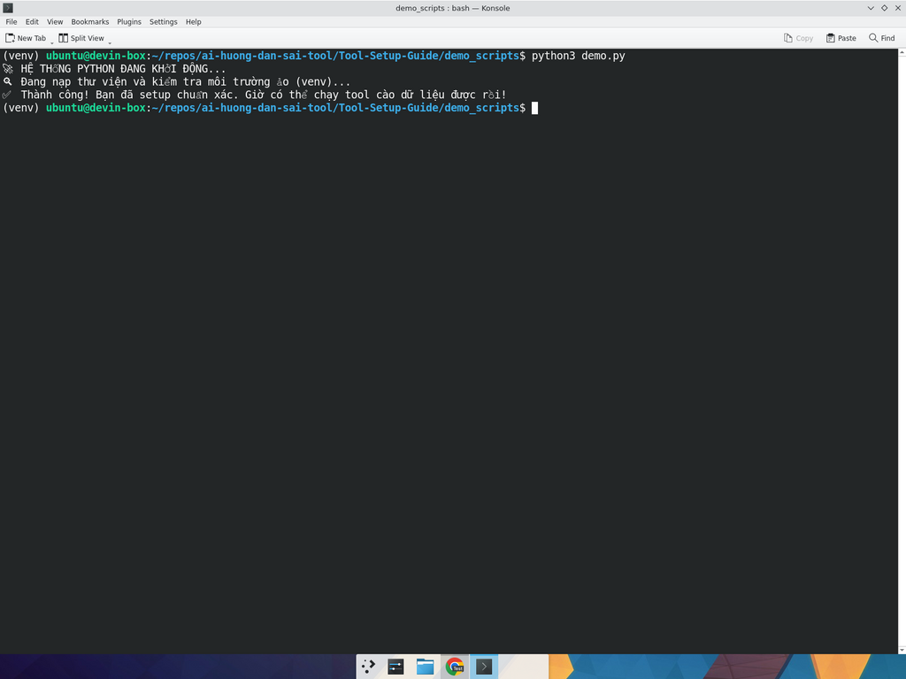

# 🐍 Hướng dẫn cài Python3 + pip + venv trên Ubuntu — Phiên bản dành cho người KHÔNG biết code

> **Đừng lo nếu bạn không biết code, cứ làm y hệt từng bước dưới đây là tool sẽ chạy mượt.** ✨

Sau khi làm xong bài này, bạn sẽ có:
- ✅ **Python3** được cài đặt
- ✅ **pip** (cài thư viện cho Python) sẵn sàng dùng
- ✅ **venv** (môi trường ảo, cực kỳ quan trọng) sẵn sàng dùng
- ✅ Một file demo `demo.py` chạy thành công và in ra "**Giờ có thể chạy tool cào dữ liệu được rồi!**" 🚀

---

## 🪜 BƯỚC 0 — Mở Terminal trên Ubuntu

Y chang [bài Node.js](nodejs-setup.md#-bước-0--mở-terminal-trên-ubuntu) — nhấn:

```
Ctrl + Alt + T
```

→ Cửa sổ Terminal đen đen hiện ra. **Đó là nơi mình sẽ gõ tất cả các lệnh dưới đây.**

> 💡 Mẹo: **Bấm chuột phải vào Terminal → Paste** để dán lệnh vào, hoặc nhấn **Ctrl + Shift + V**.

---

## 🪜 BƯỚC 1 — Cập nhật danh sách gói phần mềm

📋 Copy lệnh này:

```bash
sudo apt-get update
```

> 💡 **Lệnh này dùng để làm gì?** Yêu cầu Ubuntu cập nhật danh sách phần mềm mới nhất từ Internet. **Bắt buộc** chạy trước khi cài cái gì mới.

Nó có thể hỏi mật khẩu — gõ mật khẩu Ubuntu của bạn (mật khẩu **sẽ không hiện** lên màn hình nhưng vẫn đang gõ, **đừng nghĩ là máy hỏng** 😅).

---

## 🪜 BƯỚC 2 — Cài Python3 + pip + venv chỉ trong **1 dòng**

📋 Copy lệnh "thần thánh" này:

```bash
sudo apt-get install -y python3 python3-pip python3-venv
```

> 💡 **Lệnh này dùng để làm gì?** Cài đặt 3 gói cùng lúc:
> - **`python3`** → bộ thông dịch Python (cái chạy file `.py`).
> - **`python3-pip`** → công cụ cài thư viện Python từ Internet (vd: `requests`, `colorama`…).
> - **`python3-venv`** → tạo "môi trường ảo" — quan trọng cực kỳ, sẽ giải thích ở bước 4.
>
> Tham số `-y` = "tự động đồng ý", đỡ phải Enter nhiều lần.

Đợi **30 giây – 1 phút** cho nó cài xong. Khi thấy `$` quay lại nhấp nháy là OK 🎉.

---

## 🪜 BƯỚC 3 — Kiểm tra cài đặt thành công chưa

📋 Gõ lần lượt 2 lệnh:

```bash
python3 --version
```

```bash
pip3 --version
```

### ✅ Kết quả mong đợi:
- `python3 --version` → in ra dòng kiểu `Python 3.10.6` (hoặc cao hơn).
- `pip3 --version` → in ra dòng kiểu `pip 22.0.2 from /usr/lib/...`.

> 🎉 Nếu bạn thấy 2 dòng đó là **xong nửa chặng đường rồi đấy!**

❌ Nếu báo `command not found` → ghé [troubleshooting.md](troubleshooting.md) phần "Python".

---

## 🎬 Video quay đầy đủ quá trình cài Python

📹 [▶️ Xem video: media/python-install.mp4](../../media/python-install.mp4)

---

## 🪜 BƯỚC 4 — TẠO MÔI TRƯỜNG ẢO `venv` (CỰC KỲ QUAN TRỌNG) ⚠️

> 🤔 **Tại sao phải dùng `venv`?**
> Tưởng tượng máy của bạn là một cái **tủ thuốc chung** cả nhà dùng. Mỗi tool Python giống như một **toa thuốc khác nhau** — có khi cần `requests` phiên bản 2.0, có khi cần phiên bản 2.31. Nếu cứ nhét hết vào tủ chung, các thuốc sẽ "cãi nhau" và **tool gì cũng hỏng**. 🤯
>
> **`venv` = một cái tủ riêng cho từng tool**, không đụng nhau, gỡ ra cũng siêu nhanh. Vì vậy **luôn luôn** dùng `venv` khi chạy tool Python nha! 💯

### 4.1. Vào thư mục chứa tool (ví dụ thư mục `demo_scripts`)

📋 Lệnh ví dụ — bạn thay đường dẫn theo thư mục của mình:

```bash
cd ~/repos/ai-huong-dan-sai-tool/Tool-Setup-Guide/demo_scripts
```

> 💡 `cd` = "**c**hange **d**irectory" = đổi thư mục đang làm việc. Dấu `~` là viết tắt của "thư mục Home của tôi".

### 4.2. Tạo `venv` (chậm thôi, đừng vội)

📋 Copy lệnh này:

```bash
python3 -m venv venv
```

> 💡 **Lệnh này dùng để làm gì?** Tạo ra một thư mục mới tên là `venv` (chữ cuối) bên trong thư mục hiện tại. Bên trong đó là một **bản Python riêng + chỗ cất thư viện riêng** cho dự án.

Đợi vài giây cho xong. Bạn có thể gõ `ls` để thấy folder `venv/` vừa hiện ra.

### 4.3. **KÍCH HOẠT** môi trường ảo (đoạn này phải nhìn kỹ!) 👀

📋 Copy lệnh thần kỳ này:

```bash
source venv/bin/activate
```

> 💡 **Lệnh này dùng để làm gì?** "Bật công tắc" cho môi trường ảo. Sau khi gõ xong, **dòng prompt sẽ thay đổi**.

### ✨ Sự khác biệt RẤT QUAN TRỌNG bạn cần thấy:

🔴 **TRƯỚC khi kích hoạt:**
```
ubuntu@devin-box:~/repos/ai-huong-dan-sai-tool/Tool-Setup-Guide/demo_scripts$
```

🟢 **SAU khi kích hoạt — có chữ `(venv)` ở đầu dòng:**
```
(venv) ubuntu@devin-box:~/repos/ai-huong-dan-sai-tool/Tool-Setup-Guide/demo_scripts$
```

> 👀 **Nếu bạn thấy chữ `(venv)` nhỏ xíu ở đầu dòng → CHÚC MỪNG, bạn đã vào môi trường ảo thành công!** 🥳
>
> Nếu KHÔNG thấy → mở [troubleshooting.md](troubleshooting.md) phần "venv không hoạt động".

---

## 🎬 Video quay CHẬM cảnh tạo + kích hoạt venv (xem cho rõ chữ `(venv)`)

📹 [▶️ Xem video: media/python-venv.mp4](../../media/python-venv.mp4)

> ⏯️ Mình quay video này hơi chậm để bạn nhìn rõ **trước và sau** khi gõ lệnh `source venv/bin/activate` — chữ `(venv)` xuất hiện ngay trước tên user. **Đó chính là dấu hiệu bạn làm đúng.**

---

## 🪜 BƯỚC 5 — Cài thư viện cần thiết (`requests` + `colorama`)

### 5.1. Tạo file `requirements.txt`

📋 Gõ lệnh:

```bash
nano requirements.txt
```

Màn hình sẽ đen xì lại — đừng sợ 😄. Chuột phải → Paste đoạn dưới đây vào:

```text
requests
colorama
```

- Nhấn **`Ctrl + O`** → **Enter** để lưu.
- Nhấn **`Ctrl + X`** để thoát ra.

### 5.2. Cài 2 thư viện

📋 (Nhớ phải còn `(venv)` ở đầu dòng nha!) Copy lệnh:

```bash
pip install -r requirements.txt
```

> 💡 **Lệnh này dùng để làm gì?** `pip install -r requirements.txt` nghĩa là: "Đọc file `requirements.txt`, có bao nhiêu thư viện thì cài đủ luôn vào `venv` này". Đây là cách cài thư viện chuẩn của giới Python 🎓.

Bạn sẽ thấy hàng loạt dòng `Downloading...` và `Successfully installed ...`. Vậy là xong. ✅

---

## 🪜 BƯỚC 6 — Chạy tool demo `demo.py`

### 6.1. Tạo file `demo.py`

📋 Gõ lệnh:

```bash
nano demo.py
```

Màn hình đen xì → **Chuột phải → Paste** đoạn code này vào:

```python
import time
print("🚀 HỆ THỐNG PYTHON ĐANG KHỞI ĐỘNG...")
time.sleep(1)
print("🔍 Đang nạp thư viện và kiểm tra môi trường ảo (venv)...")
time.sleep(1)
print("✅ Thành công! Bạn đã setup chuẩn xác. Giờ có thể chạy tool cào dữ liệu được rồi!")
```

- **`Ctrl + O`** → **Enter** để lưu.
- **`Ctrl + X`** để thoát.

### 6.2. Chạy file

📋 Gõ:

```bash
python3 demo.py
```

> 💡 **Lệnh này dùng để làm gì?** Bảo Python: "Mở file `demo.py` ra và chạy giúp tao".

Đợi **2 giây** (vì code có 2 cái `time.sleep(1)`).

### ✅ Kết quả mong đợi (3 dòng):

```
🚀 HỆ THỐNG PYTHON ĐANG KHỞI ĐỘNG...
🔍 Đang nạp thư viện và kiểm tra môi trường ảo (venv)...
✅ Thành công! Bạn đã setup chuẩn xác. Giờ có thể chạy tool cào dữ liệu được rồi!
```

---

## 🖼️ Đối chiếu kết quả với ảnh thật

📷 Đây là ảnh chụp màn hình thật lúc mình chạy `python3 demo.py` (để ý chữ `(venv)` ở đầu prompt nha):



> 🎉 **Nếu màn hình của bạn hiện ra y hệt hình trên (kèm `(venv)` ở đầu dòng), chúc mừng, bạn đã làm đúng 100%!**
>
> Giờ bạn có thể chạy được hầu hết các tool Python phổ biến rồi 🚀.

---

## 🪜 BƯỚC 7 — Khi xong việc, **TẮT** môi trường ảo

📋 Gõ:

```bash
deactivate
```

> 💡 **Lệnh này dùng để làm gì?** Tắt môi trường ảo `venv` đang chạy. Sau lệnh này, chữ `(venv)` ở đầu dòng sẽ **biến mất** — về lại Terminal bình thường.

> ⚠️ **Khi quay lại làm việc với tool Python lần sau**, bạn chỉ cần `cd` đến thư mục đó và gõ lại `source venv/bin/activate` — KHÔNG cần tạo `venv` lại từ đầu.

---

## 🆘 Bị lỗi ư? Đừng panic!

Mở [troubleshooting.md](troubleshooting.md) → tìm đến phần "Python" hoặc "venv". Lỗi 95% là đã có sẵn lời giải trong đó. 💪

---

## 🎓 Bạn đã học được gì?

- ✅ Cài Python3 + pip + venv chỉ bằng 1 dòng lệnh `apt-get install`
- ✅ Hiểu **tại sao phải dùng venv** (khỏi đụng thư viện chung)
- ✅ Cách **tạo, kích hoạt, tắt** một venv
- ✅ Cài thư viện qua `pip install -r requirements.txt`
- ✅ Chạy file `.py` đầu tiên trong đời 🥳

**Bây giờ bạn đã có thể tự setup một tool Python bất kỳ rồi đó!** Quay lại [README.md](../../README.md) để xem mục lục, hoặc đọc [troubleshooting.md](troubleshooting.md) phòng khi gặp lỗi.
