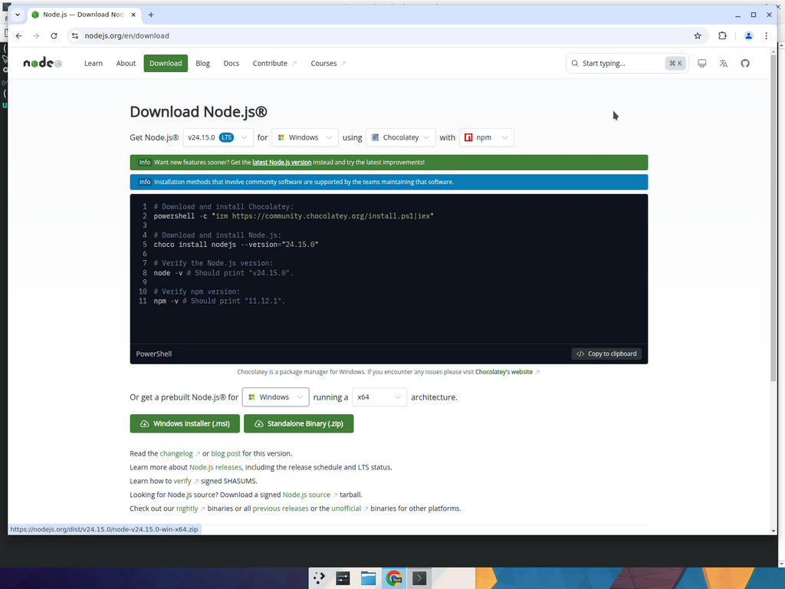

# 🟢 Cài Node.js trên Windows 10/11 — Chỉ cần biết xài chuột là cài được

> **Đừng lo nếu bạn không biết code. Chỉ cần biết bấm chuột là làm được — cứ Next-Next-Install thôi.** ✨

Bài này dành riêng cho người dùng **Windows 10 / Windows 11**, hoàn toàn **không gõ lệnh phức tạp**, không cần Terminal cao siêu. Sau khoảng **5 phút**, máy bạn sẽ chạy được tool Node.js đầu tiên.

Sau khi xong bạn có:
- ✅ Node.js bản LTS (kèm `npm`) cài sẵn trên Windows
- ✅ Một file demo `demo.js` chạy được, in ra **"Tool hoạt động bình thường trên Windows."** 🎉

---

## 🪜 BƯỚC 1 — Tải file cài đặt `.msi` từ trang chủ Node.js

📍 Mở trình duyệt (Chrome / Edge / Firefox đều được) → vào địa chỉ:

```
https://nodejs.org/en/download
```

📷 Bạn sẽ thấy một trang giống hệt hình dưới đây:



### 👉 Hướng dẫn chọn:
1. Ở dòng "**Get Node.js®**", giữ nguyên phiên bản có chữ **LTS** màu xanh (đó là phiên bản ổn định nhất 💪).
2. Trong dropdown "**for**" → chọn **`Windows`** (logo cửa sổ Microsoft).
3. Kéo xuống mục **"Or get a prebuilt Node.js® for Windows running a x64"**.
4. Bấm vào **nút xanh lá lớn `Windows Installer (.msi)`** → trình duyệt sẽ tải về một file `node-vXX.X.X-x64.msi` vào thư mục **Downloads**.

> 💡 **Hỏi nhanh:** "x64" là gì? — đó là kiến trúc CPU, hầu hết máy tính bây giờ đều là **x64**. Nếu không chắc, cứ chọn **x64** là đúng 99%.

> ⚠️ **Lưu ý:** Trang này thường mặc định hiển thị phần cài bằng **`Chocolatey`** (PowerShell). **BỎ QUA**, không phải cách dành cho người mới. Cứ kéo xuống tìm đúng nút **`.msi`** màu xanh lá là được.

---

## 🪜 BƯỚC 2 — Cài đặt: bấm Next → Next → Install → Finish 🥳

### 2.1. Chạy file installer

📍 Mở **File Explorer** (biểu tượng thư mục vàng ở thanh taskbar) → vào thư mục **Downloads** → **nhấp đúp** vào file `node-vXX.X.X-x64.msi` vừa tải.

> 💡 Nếu Windows hỏi "Do you want to allow this app to make changes…?" → bấm **Yes**. Đó là cảnh báo bình thường khi cài bất kỳ phần mềm nào trên Windows.

### 2.2. Bấm Next theo từng cửa sổ

| 🪟 Cửa sổ | 👆 Bạn cần làm gì? |
|----------|-------------------|
| **Welcome to the Node.js Setup Wizard** | Bấm **Next** |
| **End-User License Agreement** | Tích ô **"I accept the terms in the License Agreement"** → **Next** |
| **Destination Folder** | Cứ giữ nguyên đường dẫn mặc định `C:\Program Files\nodejs\` → **Next** |
| **Custom Setup** | KHÔNG cần chỉnh gì — **Next** |
| **Tools for Native Modules** | Bỏ qua, KHÔNG tích → **Next** *(tránh phải tải thêm vài GB Visual Studio không cần thiết)* |
| **Ready to install Node.js** | Bấm **Install** 🚀 |
| **Installing…** | Đợi **30 giây – 1 phút**, có thanh chạy xanh xanh |
| **Completed the Node.js Setup Wizard** | Bấm **Finish** 🎉 |

> 🎉 **Vậy là Node.js đã cài xong!** Bạn không cần làm gì thêm với file `.msi` đó nữa.

[📸 CHÈN ẢNH: Chụp một cửa sổ "Welcome to the Node.js Setup Wizard" để minh họa]

[📸 CHÈN ẢNH: Chụp cửa sổ "Completed the Node.js Setup Wizard" với nút Finish]

---

## 🪜 BƯỚC 3 — Mở "CMD thần thánh" ngay tại thư mục tool (KHÔNG cần `cd`!)

> 🤔 **Tại sao mục này tên là "CMD thần thánh"?**
> Nhiều bạn mới thường mở CMD ở đường dẫn `C:\Users\TenCuaBan\` rồi loay hoay gõ `cd D:\Tool\...` mãi không vào đúng được thư mục. Có một mẹo "thần thánh" giúp bạn **mở thẳng CMD vào đúng thư mục đang xem**, **chỉ với 3 ký tự** 😎.

### 👉 Mẹo mở CMD nhanh nhất Windows (làm 1 lần là nhớ cả đời):

1. Mở **File Explorer** → đi đến thư mục chứa tool (ví dụ thư mục có file `demo.js`).
2. Nhìn lên **thanh địa chỉ** (cái thanh ở trên cùng có ghi đường dẫn kiểu `D:\Tool\my-bot`).
3. **Click chuột trái 1 cái vào thanh địa chỉ đó** — đường dẫn sẽ chuyển thành dạng có thể chỉnh sửa được.
4. **Xoá hết** đường dẫn → **gõ chính xác 3 chữ:** `cmd`
5. Nhấn **Enter**.

✨ **PHÉP MÀU XẢY RA:** Một cửa sổ **CMD nền đen** sẽ bật lên, **đã đứng sẵn ngay tại thư mục** chứa tool. Không phải gõ `cd` gì hết.

[📸 CHÈN ẢNH: Chụp thanh địa chỉ của File Explorer đang gõ chữ `cmd` thay cho đường dẫn]

[📸 CHÈN ẢNH: Chụp cửa sổ CMD vừa mở ra, dòng đầu hiện đường dẫn của thư mục tool]

> 💡 **Mẹo này áp dụng cho cả Python**, cả PowerShell (gõ `powershell` thay vì `cmd`). Bạn vừa học một kỹ năng "đỉnh" của dân IT rồi đấy 😎.

---

## 🪜 BƯỚC 4 — Kiểm tra Node.js đã cài thành công

📋 Trong cửa sổ CMD vừa mở, gõ lần lượt 2 lệnh sau (sau mỗi lệnh nhấn **Enter**):

```cmd
node -v
```

```cmd
npm -v
```

> 💡 **Lệnh này dùng để làm gì?**
> - `node -v` → in ra phiên bản Node.js (ví dụ: `v22.12.0`).
> - `npm -v` → in ra phiên bản npm (ví dụ: `10.8.3`).

### ✅ Kết quả mong đợi:
Hiện ra 2 dòng có chữ `v...` và một số phiên bản → **CÀI THÀNH CÔNG 100%!** 🥳

> ❌ Nếu báo `'node' is not recognized as an internal or external command…` → xem mục [troubleshooting.md → "Node not recognized"](troubleshooting.md#-node-not-recognized-trên-windows).

---

## 🪜 BƯỚC 5 — (Nếu tool có file `package.json`) Cài thư viện bằng `npm install`

Nhiều tool sẽ kèm theo file `package.json` — đó là "danh sách thư viện cần cài" cho tool. Cách cài cực đơn giản:

📋 Trong cửa sổ CMD đang đứng tại thư mục tool, gõ:

```cmd
npm install
```

> 💡 **Lệnh này dùng để làm gì?** Nó đọc file `package.json`, **tự động tải mọi thư viện cần thiết** về thư mục `node_modules/`. Chờ vài giây đến vài phút (tuỳ Internet và độ "nặng" của tool).

### ✅ Khi nào biết là xong?
Khi CMD hiện trở lại dòng `D:\Tool\my-bot>` (hết các dòng `npm warn ...`) → tool đã có đủ thư viện. ✨

> ℹ️ Nếu **tool KHÔNG có** file `package.json`, bạn có thể **bỏ qua hoàn toàn bước này**.

---

## 🪜 BƯỚC 6 — Chạy tool demo: `node demo.js`

### 6.1. Tạo file `demo.js` trong thư mục tool

📌 Cách đơn giản nhất cho người mới:
1. Trong File Explorer, vào thư mục tool.
2. Bấm chuột phải khoảng trống → **New → Text Document** → đặt tên là `demo.js` (nhớ xoá đuôi `.txt`, để đúng `.js`).
3. Bấm chuột phải vào file `demo.js` → **Open with → Notepad**.
4. Copy đoạn code dưới đây vào Notepad → **Ctrl + S** để lưu → đóng Notepad.

📋 Nội dung file `demo.js`:

```javascript
console.log("🚀 Kích hoạt Tool Auto Request (Node.js)...");
setTimeout(() => console.log("✅ Kết nối máy chủ thành công. HTTP Status: 200"), 1000);
setTimeout(() => console.log("💰 Đã nhận dữ liệu thành công! Tool hoạt động bình thường trên Windows."), 2000);
```

> ⚠️ **Lưu ý quan trọng về đuôi file:** Windows đôi khi ẩn đuôi file. Vào tab **View** trên File Explorer → tích ô **"File name extensions"** để thấy đuôi `.js`. Nếu file đang là `demo.js.txt` → đổi tên xoá phần `.txt` đi.

### 6.2. Chạy file `demo.js`

📋 Quay lại CMD đang đứng tại thư mục tool, gõ:

```cmd
node demo.js
```

> 💡 **Lệnh này dùng để làm gì?** Bảo Node.js: "Mở file `demo.js` ra và chạy giúp tao".

Đợi **2 giây** (vì code có `setTimeout` 1s + 2s).

### ✅ Bạn sẽ thấy 3 dòng kết quả như sau:

```
🚀 Kích hoạt Tool Auto Request (Node.js)...
✅ Kết nối máy chủ thành công. HTTP Status: 200
💰 Đã nhận dữ liệu thành công! Tool hoạt động bình thường trên Windows.
```

> 🎉 **Nếu màn hình của bạn hiện ra y hệt 3 dòng trên, chúc mừng — Node.js trên Windows của bạn ngon lành rồi!** Bạn có thể chạy bất kỳ tool Node.js nào người ta gửi cho theo cách này.

[📸 CHÈN ẢNH: Chụp cửa sổ CMD trên Windows hiện ra 3 dòng kết quả ở trên — placeholder để bạn tự bổ sung khi test trên máy Windows thật]

---

## 🆘 Bị lỗi ư? Đừng panic!

Mở [troubleshooting.md](troubleshooting.md) — 95% lỗi thường gặp đã có sẵn lời giải. 💪

---

## 🎓 Bạn đã học được gì?

- ✅ Cài Node.js bằng **file `.msi`** trên Windows (Next → Install → Finish)
- ✅ Mẹo "CMD thần thánh" — gõ `cmd` vào thanh địa chỉ File Explorer
- ✅ Kiểm tra cài đặt qua `node -v`, `npm -v`
- ✅ Cài thư viện tool với `npm install`
- ✅ Chạy file `.js` đầu tiên trên Windows

> Tiếp theo qua [python-setup.md](python-setup.md) để cài Python — flow tương tự nhưng có **1 ô tích "thần kỳ"** mà bạn KHÔNG được quên đâu nha! 🐍
