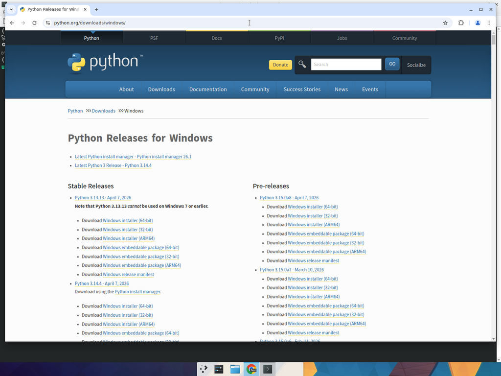

# 🐍 Cài Python trên Windows 10/11 — KHÔNG cần venv, ai cũng cài được

> **Đừng lo nếu bạn không biết code. Cứ nhấp chuột theo từng bước, đặc biệt là CÁI Ô VUÔNG ở Bước 2 — quyết định 90% thành bại đấy!** ⚠️✨

Bài này dành cho người dùng **Windows 10 / Windows 11** muốn chạy các tool Python kiểu **bot request / airdrop / auto** đơn giản. **KHÔNG dùng `venv`** cho đỡ rườm rà — phù hợp với 99% tool script lẻ tẻ.

Sau khi xong bạn sẽ có:
- ✅ Python đã cài sẵn, gọi được `python` từ bất cứ đâu.
- ✅ `pip` (cài thư viện) sẵn sàng dùng.
- ✅ Một file demo `demo.py` chạy được, in ra **"Thu thập dữ liệu xong!"** 💰

---

## 🪜 BƯỚC 1 — Tải file `.exe` Python từ trang chủ chính chủ

📍 Mở trình duyệt → vào địa chỉ:

```
https://www.python.org/downloads/windows/
```

📷 Bạn sẽ thấy một trang giống hệt hình dưới đây:



### 👉 Hướng dẫn chọn:
1. Ở dòng đầu trang, bấm vào liên kết **"Latest Python 3 Release - Python 3.x.x"** (đó là phiên bản mới nhất ổn định 💪).
2. Trang Release cuộn xuống cuối, tìm tới mục **"Files"**.
3. Bấm vào dòng **`Windows installer (64-bit)`** → trình duyệt tải về file `python-3.X.X-amd64.exe` vào thư mục **Downloads**.

> 💡 **Cách "lười" hơn nữa:** vào thẳng `https://www.python.org/downloads/` → bấm **nút màu vàng to "Download Python 3.x.x"** ở giữa trang → trình duyệt tự chọn đúng file `.exe` cho Windows luôn 😎.

> ⚠️ **TUYỆT ĐỐI tránh:**
> - Bản **"Python 2.x"** (đã ngừng hỗ trợ từ 2020).
> - Các bản **alpha / beta** (mục Pre-releases).
> - Các bản **embeddable package** (không có trình cài).
>
> Cứ chọn **"Latest Python 3 Release"** + **"Windows installer (64-bit)"** là đúng.

---

## 🪜 BƯỚC 2 — ⚠️🔥 BƯỚC SỐNG CÒN: PHẢI TÍCH Ô "Add python.exe to PATH" ⚠️🔥

> 🚨🚨🚨 **CHÚ Ý — đọc 3 lần đoạn này:**
>
> Khi bạn nhấp đúp vào file `python-3.X.X-amd64.exe`, ngay **màn hình ĐẦU TIÊN** sẽ hiện ra một cửa sổ với:
> - 1 nút lớn ở giữa: **"Install Now"** (rất hấp dẫn 👀).
> - 1 nút khác: **"Customize installation"**.
> - **Phía DƯỚI CÙNG cửa sổ** có 2 ô vuông tích — trong đó có ô:
>
> ## ☑️ **`Add python.exe to PATH`** *(hoặc `Add Python 3.x to PATH` ở bản cũ hơn)*
>
> ### 👉 **BẠN PHẢI TÍCH VÀO Ô NÀY trước khi bấm "Install Now"!** 👈

[📸 CHÈN ẢNH: Chụp màn hình Python Installer ở bước đầu, vẽ vòng tròn ĐỎ + mũi tên to vào ô "Add python.exe to PATH" ở cuối cửa sổ — placeholder để bạn tự bổ sung khi test trên máy Windows thật]

> 🤔 **Vì sao ô này quyết định 90% thành bại?**
> Tích ô này → Windows hiểu "Python đã được cài, chạy `python` ở bất cứ đâu cũng được". KHÔNG tích → bạn sẽ liên tục nhận lỗi `'python' is not recognized as an internal or external command…` và phải gỡ ra cài lại từ đầu. **Đừng để mất 30 phút sau mới phát hiện ra nha!** 😭

### 👉 Quy trình đầy đủ:
1. Nhấp đúp vào file `python-3.X.X-amd64.exe` đã tải.
2. Nếu Windows hỏi "Do you want to allow…?" → bấm **Yes**.
3. **TRƯỚC TIÊN tích vào ô `Add python.exe to PATH`** ở dưới cùng cửa sổ. ✅
4. (Có thể tích thêm cả ô `Use admin privileges when installing py.exe` nếu có).
5. Bấm **Install Now**.
6. Đợi thanh xanh chạy ~30 giây – 1 phút.
7. Khi thấy "**Setup was successful**" → bấm **Close** 🎉.

[📸 CHÈN ẢNH: Chụp màn hình "Setup was successful" của Python Installer]

> 💡 **Có thấy dòng `Disable path length limit`?** Bấm vào nó luôn cho yên tâm — giúp Windows không "gắt" khi đường dẫn dài quá 260 ký tự (hay gặp khi `pip install`). Sau đó **Yes** xác nhận, rồi mới Close.

---

## 🪜 BƯỚC 3 — Mở "CMD thần thánh" ngay tại thư mục tool (mẹo y hệt Node.js)

> 💡 Nếu bạn đã đọc [nodejs-setup.md](nodejs-setup.md) thì có thể nhảy luôn xuống Bước 4 — flow CMD y hệt.

### 👉 Mở CMD trong **3 ký tự**:

1. Mở **File Explorer** → đi đến thư mục chứa tool Python (chỗ có file `demo.py`).
2. **Click chuột vào thanh địa chỉ** (chỗ ghi đường dẫn kiểu `D:\Tool\my-bot`).
3. **Xoá hết** đường dẫn → gõ chính xác `cmd` → **Enter**.

✨ Một cửa sổ CMD đen đen bật ra, **đã đứng sẵn tại thư mục tool**. Không phải `cd` gì cả!

[📸 CHÈN ẢNH: Chụp thanh địa chỉ File Explorer đang gõ chữ `cmd` — placeholder]

> 🎓 **Mẹo này thần thánh ở chỗ:** mỗi lần bạn muốn chạy tool, chỉ cần mở thư mục → gõ `cmd` → Enter là xong. **KHÔNG bao giờ phải nhớ đường dẫn dài.**

---

## 🪜 BƯỚC 4 — Kiểm tra Python đã cài thành công

📋 Trong CMD vừa mở, gõ:

```cmd
python --version
```

```cmd
pip --version
```

> 💡 **Lệnh này dùng để làm gì?**
> - `python --version` → in ra phiên bản Python (ví dụ: `Python 3.13.1`).
> - `pip --version` → in ra phiên bản pip (ví dụ: `pip 24.x.x from C:\Python313\Lib\site-packages\pip ...`).

### ✅ Kết quả mong đợi:
Cả 2 dòng đều in ra số phiên bản → **CÀI THÀNH CÔNG!** 🥳

### ❌ Báo lỗi `'python' is not recognized…`?
**95% là quên tích ô `Add python.exe to PATH` ở Bước 2.**
- 👉 Mở **Settings → Apps → Installed apps** → tìm "Python" → **Uninstall**.
- 👉 Cài lại từ đầu, **lần này TÍCH ô `Add python.exe to PATH`**. ⚠️

---

## 🪜 BƯỚC 5 — Cài thư viện thẳng vào máy bằng `pip install` (KHÔNG dùng venv)

> ℹ️ **Vì sao không dùng venv ở đây?**
> Với các tool **bot request / airdrop / cào dữ liệu** đơn giản (chỉ vài ba thư viện), **cài thẳng pip vào máy nhanh hơn rất nhiều**. Bạn không cần phải bật/tắt môi trường, không cần nhớ `source venv/bin/activate` — gõ `python demo.py` là chạy luôn 🚀. Phù hợp 99% tool airdrop trên thị trường.

### 5.1. Đảm bảo có file `requirements.txt`

Trong thư mục tool nên có file `requirements.txt` chứa danh sách thư viện. Ví dụ tool demo dùng file:

```text
requests
```

> 💡 `requests` là thư viện kinh điển của Python để **bắn HTTP request** — gần như mọi tool kiểu bot/airdrop đều cần.

### 5.2. Chạy lệnh `pip install -r requirements.txt`

📋 Trong CMD đứng tại thư mục tool, gõ:

```cmd
pip install -r requirements.txt
```

> 💡 **Lệnh này dùng để làm gì?** Đọc file `requirements.txt`, có bao nhiêu thư viện thì pip tự tải đủ về máy. Đợi vài giây cho dòng `Successfully installed requests-x.x.x` hiện ra là OK 🎉.

> ❌ Nếu báo `error: externally-managed-environment` → xem [troubleshooting.md](troubleshooting.md). Lỗi này hiếm trên Windows, hay gặp ở Linux.

---

## 🪜 BƯỚC 6 — Chạy tool demo: `python demo.py`

### 6.1. Tạo file `demo.py` trong thư mục tool

📌 Cách đơn giản nhất:
1. Trong File Explorer, vào thư mục tool.
2. Bấm chuột phải khoảng trống → **New → Text Document** → đặt tên `demo.py` (xoá `.txt`).
3. Bấm chuột phải vào `demo.py` → **Open with → Notepad**.
4. Copy đoạn code dưới đây vào → **Ctrl + S** để lưu → đóng Notepad.

📋 Nội dung file `demo.py`:

```python
import time
print("🚀 Kích hoạt Tool Auto Request (Python)...")
time.sleep(1)
print("✅ Gửi request thành công. Đã bypass Cloudflare.")
time.sleep(1)
print("💰 Thu thập dữ liệu xong! Bạn đã cài Python chuẩn xác, không cần venv rườm rà.")
```

> ⚠️ Đảm bảo đuôi file là `.py` chứ không phải `.py.txt` (View → tick "File name extensions" trong File Explorer).

### 6.2. Chạy file

📋 Quay lại CMD, gõ:

```cmd
python demo.py
```

> 💡 **Lệnh này dùng để làm gì?** Bảo Python: "Mở file `demo.py` ra và chạy giúp tao".

Đợi **2 giây** (vì code có 2 lệnh `time.sleep(1)`).

### ✅ Bạn sẽ thấy 3 dòng kết quả:

```
🚀 Kích hoạt Tool Auto Request (Python)...
✅ Gửi request thành công. Đã bypass Cloudflare.
💰 Thu thập dữ liệu xong! Bạn đã cài Python chuẩn xác, không cần venv rườm rà.
```

> 🎉 **Nếu màn hình của bạn hiện ra y hệt 3 dòng trên, chúc mừng — Python trên Windows của bạn đã sẵn sàng cho mọi tool airdrop / bot request!**

[📸 CHÈN ẢNH: Chụp cửa sổ CMD trên Windows hiện ra 3 dòng kết quả ở trên — placeholder để bạn tự bổ sung khi test trên máy Windows thật]

---

## 🆘 Bị lỗi ư? Đừng panic!

Mở [troubleshooting.md](troubleshooting.md) → tìm phần "Python (Windows)". 💪

---

## 🎓 Bạn đã học được gì?

- ✅ Cài Python từ file `.exe` chính chủ trên Windows
- ✅ Hiểu **TẦM QUAN TRỌNG SỐNG CÒN** của ô tích `Add python.exe to PATH` ⚠️
- ✅ Mẹo "CMD thần thánh" — `cmd` trong thanh địa chỉ File Explorer
- ✅ Cài thư viện thẳng vào máy với `pip install -r requirements.txt`
- ✅ Chạy file `.py` đầu tiên trên Windows mà KHÔNG cần venv

**Bây giờ bạn đã đủ trình để chạy hầu hết các tool airdrop / bot request bằng Python rồi đó! 🚀**

> Quay lại [README.md](../README.md) để xem mục lục, hoặc tham khảo [troubleshooting.md](troubleshooting.md) khi gặp lỗi.
